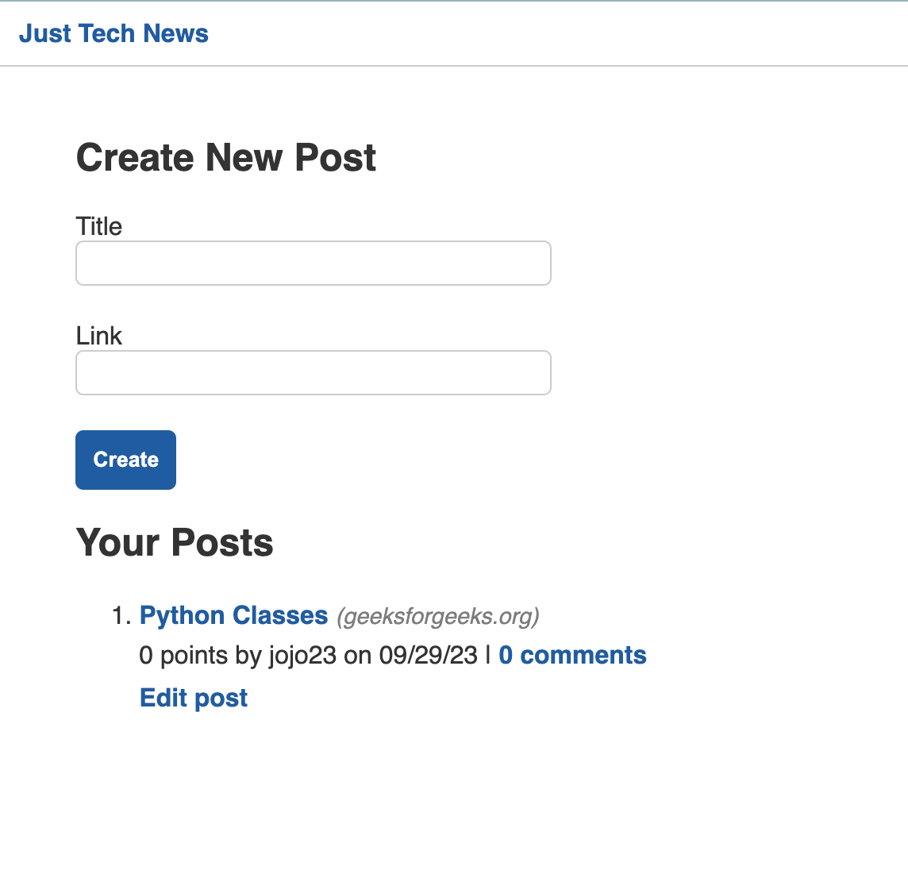

# Python NewsFeed

## Description
  This is a social media application that lets users submit links to tech-related articles, comment on other users' articles, and upvote articles for points. The app was built using Python, MySQL, PyMySQL, SQLAlchemy (ORM), bycrpt (password hashing), Flask and gunicorn.

## Table of Contents
  - [Installation](#installation)
  - [Usage](#usage)
  - [Features](#features)
  - [License](#license)

## Installation
  No installation required. You can access the application at https://white-hibiscus-6e093397bc5f.herokuapp.com/ 

 ## Usage
  The application has been deployed to Heroku. The URL of the deployed application is https://white-hibiscus-6e093397bc5f.herokuapp.com/
  

  

## Features
* Python
* Flask
* MySQL
* PyMySQL
* SQLAlchemy (ORM)
* Gunicorn
* Jinja
* bycrypt
* python-dotenv

## License
The project is licensed under MIT. For more information, please refer to the LICENSE in the repo.
  

